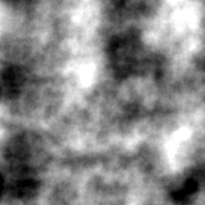

# Noise Generation

Small implementation of some noise generators in C++, with a small abstraction layer that allows for easy addition of more noise types in the future,

The current supported noise types are:
- Perlin Noise
- Voronoi Noise

## Overview
Perlin noise is a type of gradient noise commonly used in procedural content generation, such as for creating textures, terrain, and other natural-looking phenomena in computer graphics.

It is splitted into two parts, a library for geenrating the noise and a small application that uses it with a command line interface.

## Building
For dependencies, you must install  vcpkg, available [here](https://vcpkg.io/).  
As it is a  CMake project, you can build it using the following commands:

```bash
cmake --preset x64-debug
cmake --build --preset x64-debug
```

or using the CMake integration of your preffered IDE.

## Using the CLI app

The CLI app is a simple application that generates a noise image and saves it to a file, exposing multiple configuration options.  
Following, the help message of the application:

```bash
Generate different noises with different options.
Usage:
  noise-generator [OPTION...]

  -t, --type arg    The type of noise to generate.
  -s, --seed arg    Seed used by the generator
  -w, --width arg   The width of the noise.
  -h, --height arg  The height of the noise.
  -g, --grid arg    The grid size of the noise. (default: 400)
  -p, --passes arg  The number of passes used to generate the noise.
                    (default: 3)
  -o, --output arg  The output file.
```

## Example
A perlin noise generated with the following command:
```bash
noise-generator -t perlin -s 24 -w 400 -h 400 -g 100 -p 3 -o perlin.png
```


## License

This project is licensed under the  (Do What the Fuck You Want to Public License).  
You're free to do what you want with the code as long as you do not hold the author liable.
